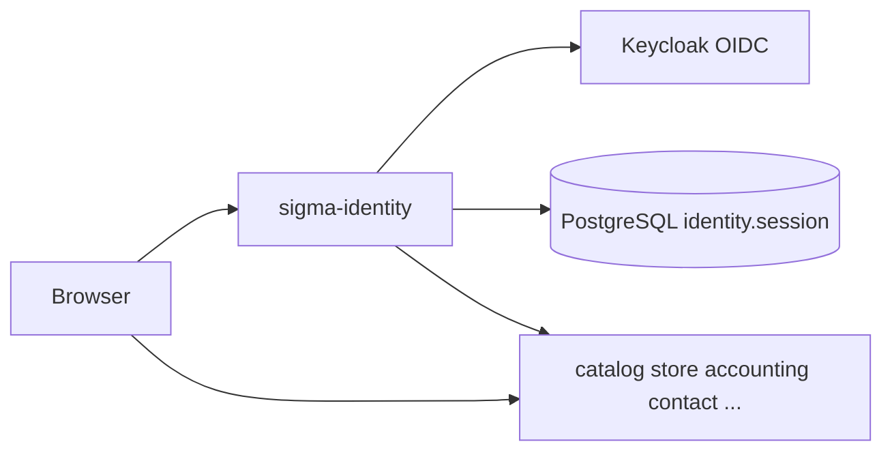

# sigma-identity architecture

`sigma-identity` is the backend-for-frontend identity service for Sigma Tactical Group. It performs OIDC login, stores server-side sessions in PostgreSQL, proxies authenticated API traffic to peer services with JWT and CSRF protection, and serves static assets and registration flows.

## Context

This service owns the PostgreSQL `identity` schema for `identity.session` rows only. User accounts live in Keycloak, not in this database.

## Runtime shape

The `sigma-identity` binary calls `sigma_identity::run()`, which builds an **Axum** router (not Warp), binds `listen_port()` (default `3000`), and serves with graceful shutdown on `SIGTERM`/`ctrl-c`. Sessions use `tower-sessions` backed by PostgreSQL. The theme crate supplies Askama error pages and shared chrome via the `axum` feature.

The BFF holds the browser session cookie and attaches Bearer tokens when proxying `/api/*` to configured backends. Machine clients may use Bearer auth on admin paths without the session cookie.

## Request flow

The Axum app mounts auth routes under `/auth` (login, callback, refresh, CSRF token, status, logout), optional registration under `/register`, profile and admin user management, authenticated proxy routes under `/api/*`, static files from `files_dir()`, monitoring at `/up` and `/health`, and geo lookup at `/geo/regions`.

Login redirects through Keycloak; the callback stores tokens in the session. Proxied requests require a valid session and CSRF header except `OPTIONS`. Registration uses Keycloak Admin API and human-check when enabled.

## Code map

| Path | Responsibility |
| --- | --- |
| `src/main.rs` | Delegates startup to `sigma_identity::run()`. |
| `src/lib.rs` | Orchestrates session, OIDC, proxy, and router assembly. |
| `src/config.rs` | Reads peer URLs, OIDC overrides, registration, and session settings. |
| `src/http.rs` | Axum app, proxy filter chain, static file serving. |
| `src/auth/` | OIDC login, logout, registration, and admin user flows. |
| `src/session.rs` | PostgreSQL session store and cookie settings. |
| `src/monitoring.rs` | Health and readiness routes. |
| `src/site_nav.rs` | Shared navbar data for themed pages. |
| `src/geo.rs` | Region lookup API. |
| `nav/` | `sigma-identity-nav` crate consumed by peer services. |

## Data

PostgreSQL schema `identity` stores encrypted session records only. OIDC tokens and profile claims live in the session payload; user directory data is fetched from Keycloak on demand.

## Configuration

Variables use the `IDENTITY_` prefix; deprecated `RIDSER_*` names are accepted as fallbacks where noted.

| Environment variable | Purpose |
| --- | --- |
| `PORT` | Listen port when `IDENTITY_BIND_PORT` is unset (Cloud Run convention). |
| `IDENTITY_BIND_PORT` | Preferred listen port (default `3000`). |
| `IDENTITY_BIND_ADDRESS` | Bind address (default `::`; read in `http.rs`). |
| `IDENTITY_CART_PUBLIC_URL` | Cart-service URL for navbar links. |
| `IDENTITY_CONTACT_PUBLIC_URL` | Contact-service URL for navbar links. |
| `IDENTITY_ADDRESSES_PUBLIC_URL` | Addresses URL for profile account links. |
| `IDENTITY_PAYMENTS_PUBLIC_URL` | Payments URL for profile account links. |
| `IDENTITY_ORDERS_PUBLIC_URL` | Orders URL for profile account links. |
| `IDENTITY_PUBLIC_BASE_URL` | Public browser base URL for email and registration links. |
| `IDENTITY_DATABASE_URL` | PostgreSQL URL for sessions (not unprefixed `DATABASE_URL`). |
| `IDENTITY_ENV` | Production flag (`production` / `prod`; also checks unprefixed `RUST_ENV`). |
| `IDENTITY_SESSION_SECURE_COOKIE_DISABLED` | When `true`, omits the Secure cookie flag. |
| `IDENTITY_SESSION_COOKIE_SAMESITE` | Session cookie SameSite mode (`none`, `lax`, `strict`). |
| `IDENTITY_SESSION_COOKIE_NAME` | Override session cookie name. |
| `IDENTITY_SESSION_COOKIE_PATH` | Override session cookie path. |
| `IDENTITY_SESSION_COOKIE_DOMAIN` | Override session cookie domain. |
| `IDENTITY_DANGER_ACCEPT_INVALID_CERTS` | Dev-only TLS bypass; refused in production. |
| `IDENTITY_FILES_DIR` | Static and SPA root (default `files` or `/files`). |
| `IDENTITY_CONFORMANCE_MODE` | Enables OIDC conformance harness assets. |
| `IDENTITY_OIDC_DISCOVERY_ISSUER_URL` | Cluster-internal OIDC discovery issuer override. |
| `IDENTITY_OIDC_TOKEN_ENDPOINT` | Cluster-internal token endpoint override. |
| `IDENTITY_OIDC_JWKS_URI` | Cluster-internal JWKS URI override. |
| `IDENTITY_KEYCLOAK_ADMIN_BASE_URL` | Internal Keycloak Admin API base URL. |
| `IDENTITY_OIDC_TOKEN_ENDPOINT_AUTH_METHOD` | Token endpoint auth method (`client_secret_basic` or `client_secret_post`). |
| `IDENTITY_OIDC_USERINFO_METHOD` | UserInfo token presentation (`header` or `body`). |
| `IDENTITY_OIDC_WEBFINGER_RESOURCE` | WebFinger resource for issuer discovery. |
| `IDENTITY_OIDC_JWKS_REFRESH_AFTER_USERINFO` | Refetch JWKS after UserInfo for rotation tests. |
| `IDENTITY_OIDC_AUTHORIZE_RESPONSE_MODE` | Authorization response mode (e.g. `form_post`). |
| `IDENTITY_LOGOUT_SEND_ID_TOKEN_HINT` | Include `id_token_hint` on RP-initiated logout. |
| `IDENTITY_REGISTRATION_DISABLED` | Disables the self-service registration page. |
| `IDENTITY_REGISTRATION_MODE` | Registration mode (`verify_email` or `auto_approve`). |
| `IDENTITY_REGISTRATION_RETURN_URIS` | Allowed `return_url` destinations for `/register`. |
| `IDENTITY_ADMIN_REALM_ROLES` | Realm roles granting `/admin/*` access (default `sigma-admin`). |
| `IDENTITY_OIDC_ISSUER_URL` | OIDC issuer (required at startup via `config::var`). |
| `IDENTITY_OIDC_CLIENT_ID` | OIDC client id (required). |
| `IDENTITY_OIDC_CLIENT_SECRET` | OIDC client secret (required). |
| `IDENTITY_OIDC_AUTH_URL` | Optional authorization endpoint override. |
| `IDENTITY_SESSION_SECRET` | Session encryption secret (≥32 bytes; required). |
| `IDENTITY_PROXY_TARGET` | Default authenticated proxy backend (required). |
| `IDENTITY_SESSION_REFRESH_THRESHOLD` | Token refresh threshold in seconds (required). |
| `IDENTITY_LOGIN_REDIRECT_APP_URIS` | Post-login app redirect allowlist (required). |
| `IDENTITY_OIDC_REDIRECT_URIS` | OAuth redirect URI allowlist (required). |
| `IDENTITY_LOGOUT_SSO_URI` | OIDC logout endpoint (required). |
| `IDENTITY_LOGOUT_REDIRECT_APP_URIS` | Post-logout app redirect allowlist (required). |
| `IDENTITY_LOGOUT_OIDC_REDIRECT_URIS` | Post-logout OIDC redirect allowlist (required). |

## Deployment

`Dockerfile` produces the `sigma-identity` image and copies the `files/` static tree. The platform deployment is at `../platform/services/identity/base/deployment.yaml`; it exposes container port `3000` through `../platform/services/identity/base/service.yaml`.

The public VirtualService and environment overlays reside beside the base manifests under `../platform/services/identity/`. Production hostname and platform context are documented in [`../platform/README.md`](../platform/README.md).

## Testing

Run `cargo test -p sigma-identity` for Rust unit and integration tests. Playwright end-to-end tests live under `tests/` (proxy and example-app flows). Local development uses `./scripts/dev-stack.sh` with Keycloak and PostgreSQL port-forward.

## Design notes

- Forked from rust-identity-service (MIT); Sigma-specific proxy, registration, and nav integration.
- CSRF protects browser-initiated proxy calls; Bearer auth serves machine clients on admin paths.
- Registration verifies email before account enablement when `REGISTRATION_MODE=verify_email`.
- Peer service URLs use `sigma-config` fail-fast validation; OIDC secrets use the dual-prefix `config::var` path.
